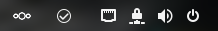
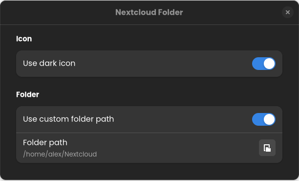

# Nextcloud Folder

A very simple and lightweigth GNOME extension to open [Nextcloud](https://nextcloud.com/) folder in one click.<br/>





##
### Installation

Install from https://extensions.gnome.org/extension/4983/nextcloud-folder/

Or build it from sources :
```bash
git clone https://github.com/alescdb/nextcloud-folder
cd nextcloud-folder
make install
```

##
### Icons

Nextcloud icons are from [Papirus Icon Theme](https://github.com/PapirusDevelopmentTeam/papirus-icon-theme)


##
### Testing

Note to myself :)

```bash
make install && dbus-run-session -- gnome-shell --nested  --wayland
```